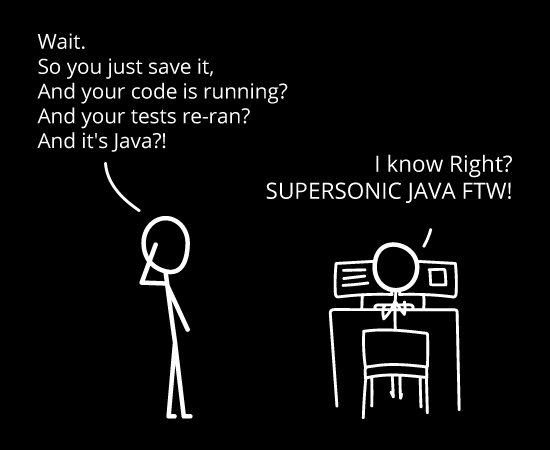

= Learn to build Cloud Native Java Applications using Quarkus

image:https://github.com/redhat-developer-demos/quarkus-tutorial/workflows/docs/badge.svg[]

Historically Java was able to handle the biggest enterprise problem(s) with its "Write once, run anywhere" (WORA) paradigm. With Cloud Native Applications grown to popularity, things like running applications as linux containers, serverless taking centere stage -- Java was pushed back by languages like golang, node.js as the forerunner to build Cloud Native Applications as they are smaller, quicker and argulably more nimble.

Quarkus is Kubernetes Native Java stack tailored for GraalVM & OpenJDK HotSpot, crafted from the best of breed Java libraries and standards.

In this tutorial we will start to explore how to create, build and deploy Cloud Native Java applications using Quarkus. The Java applications built this way are tiny as a subatomic particle (Quark) and tend to boot and run at supersonic speed

== Tutorial documentation

* HTML: https://redhat-developer-demos.github.io/quarkus-tutorial/

== Contributing

Please refer to the link:./CONTRIBUTING.adoc[how to contribute?] on how you can contribute to the tutorial
